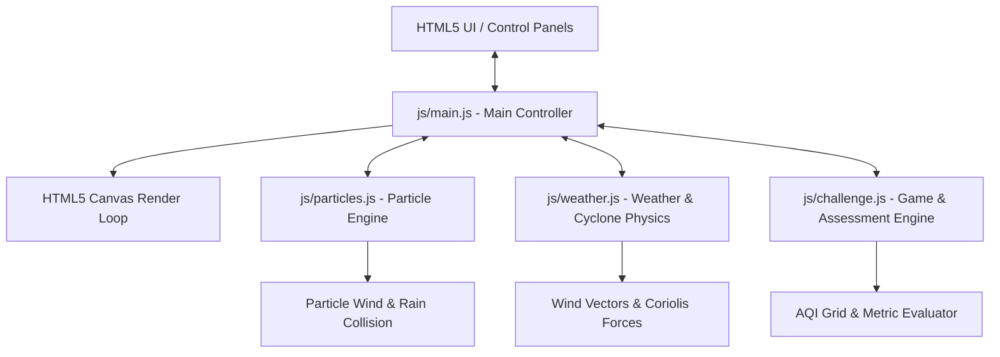

# Technical Architecture

This document describes the software architecture and module interaction of the **Atmosphere Explorer** simulation.

---

## Architecture Diagram

---

## Module Breakdown

### 1. Main Controller (`js/main.js`)
* **Role**: The central orchestrator. It manages the simulation clock (running, paused, slow motion, fast speed), registers all DOM event listeners for sliders/buttons, and runs the main `requestAnimationFrame` loop (at 60 FPS).
* **State Management**: Holds global variables such as wind speed, wind direction, temperature, humidity, active weather conditions (storm, cyclone), and science layer toggles.
* **Synchronization**: Pass state inputs to the Particle Engine and Weather Engine on every tick, and check Challenge status.

### 2. Particle Engine (`js/particles.js`)
* **Role**: Handles creation, movement, forces, and deletion of all visible particulate matter (factory smoke, car exhaust, dust).
* **Physics Model**:
  * Employs Newtonian motion (`velocity += acceleration; position += velocity;`).
  * Integrates fluid drag and wind force:
    $$\vec{F}_{wind} = C_{wind} \times \vec{V}_{wind}$$
    $$\vec{F}_{drag} = -C_{drag} \times \vec{v}_{particle}$$
  * Grid-based density analysis: Divides the center screen into a $10 \times 10$ coordinate grid to calculate localized concentrations. The total particle count directly updates the dynamic AQI calculation.

### 3. Weather & Cyclone Physics (`js/weather.js`)
* **Role**: Simulates storms, rain, lightning, cyclones, pressure structures, and vector field visual overlays.
* **Cyclone Vortex Math**:
  * Spawns a rotating circular vector field centered around the eye of the cyclone:
    $$\vec{V}_{radial} = -k_1 \cdot \vec{r} \quad (\text{Inward suction})$$
    $$\vec{V}_{tangential} = k_2 \cdot \vec{r}_{\perp} \quad (\text{Rotational velocity})$$
  * Pulls smoke particles into spiral patterns, visualizing the Coriolis-like spiral inflow.
* **Storm Rain System**: Spawns rain vector lines traveling downwards. Rain drops check for bounding box collisions with pollution particles. If a collision occurs, both the raindrop and pollution particle are destroyed (simulating atmospheric cleansing).

### 4. Challenge & Assessment Manager (`js/challenge.js`)
* **Role**: Governs the rules, victory criteria, hints, and scoring of the 4 educational missions.
* **State Engine**:
  * Tracks active mission objectives.
  * Continuously evaluates target conditions (e.g., checks if the AQI remains below 50 for 5 consecutive seconds, or verifies if pollution particles contact residential zones).
  * Manages UI dialog popups for win/lose states and stars calculation.

---

## Data Flow & Tick Cycle
On every frame (approx. 16.6ms at 60 FPS):
1. **Input Reading**: Main controller reads current positions of UI sliders and toggles.
2. **Physics Step**:
   - If a Cyclone is active, apply spiral velocity field vectors to all smoke particles.
   - Apply general wind vectors to all particles.
   - If Storm is active, update raindrop coordinates and resolve rain-to-particle collisions.
   - Move cars and emit factory smoke/exhaust based on current rate settings.
3. **Simulation Metrics Update**:
   - Calculate active AQI based on particle density counts.
   - Evaluate victory conditions of the current active challenge.
4. **Drawing Step**:
   - Clear canvas.
   - Draw background pressure overlays (if science layer is active).
   - Draw wind arrows and air current contours (if science layer is active).
   - Draw active weather systems (raindrops, lightning flashes, cyclone eye ring).
   - Draw particles (soot, exhaust, dust).
5. **UI Updates**:
   - Rotate the analog AQI gauge hand.
   - Update statistics panels, status labels, and educational prompt boxes.
