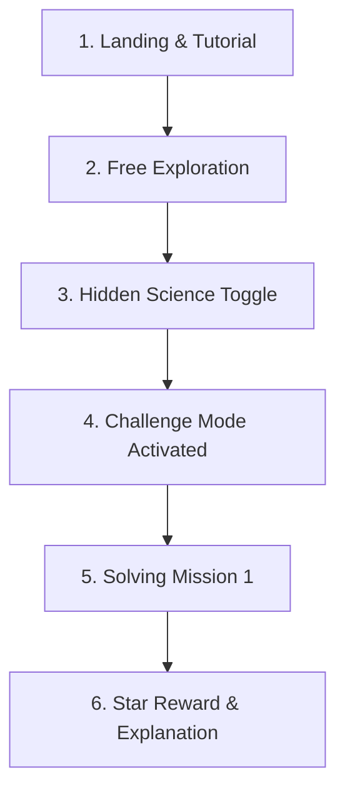

# Storyboard: Interactive Learning Journey

This storyboard illustrates the step-by-step user experience of Ravi (a 14-year-old student) as he interacts with **Atmosphere Explorer** in his school's computer lab.

---

---

### Frame 1: The Landing & Tutorial
* **Visual**: Ravi opens the webpage on a desktop. A welcoming splash screen appears with vibrant gradients showing clouds, a factory, and a winding cyclone. The text reads: *"Become an Atmosphere Explorer! Discover how wind, storms, and cyclones control the air we breathe."*
* **Action**: Ravi clicks the **"Start Simulating"** button. A quick, 3-step visual highlight tutorial points to the left controls panel, the center canvas, and the right AQI gauge.
* **Sound/Feeling**: Excitement. The UI is responsive, buttons glow on hover, and there is no text clutter.

### Frame 2: Free Exploration
* **Visual**: The simulation is running. A factory in the center environment is pumping out gray soot particles. Ravi can see cars driving along the road, puffing tiny exhaust rings. The AQI meter is slowly climbing into the yellow ("Moderate - 72") range.
* **Action**: Ravi drags the **Wind Speed** slider to maximum and shifts the **Wind Direction** to the east.
* **Feedback**: Instantly, the trees in the center bend, the cloud speed increases, and the soot particles are swept rapidly off the right side of the screen. The AQI gauge drops back down to the green ("Good - 35") zone. Ravi gasps—he can *see* dilution in action.

### Frame 3: Activating the Hidden Science Layer
* **Visual**: Curious about *how* the wind moves, Ravi clicks the **"Hidden Science Layer"** toggle on the overlay control.
* **Feedback**: The environment changes. Transparent pressure zones appear (Red clouds for High Pressure on the left, Blue zones for Low Pressure on the right). Glowing vector arrows appear across the screen, pointing from the red high-pressure zone to the blue low-pressure zone. 
* **Learning Moment**: Ravi notices that if he raises the **Temperature slider**, the pressure zones change, which automatically adjusts the wind vectors. He realizes: *temperature changes pressure, and pressure differences create wind!*

### Frame 4: Entering Challenge Mode
* **Visual**: Ravi clicks the **"Challenge Mode"** tab in the right panel. The simulation pauses and a modal pops up: *"Mission 1: Clean Air Protocol. The factory is running at full capacity, and the town's AQI has reached a dangerous 180 (Hazardous). Can you use the wind controls to lower the AQI below 50 in under 30 seconds?"*
* **Action**: Ravi clicks **"Accept Mission"**. The timer starts counting down.

### Frame 5: Solving the Challenge
* **Visual**: The factory smoke is thick. The houses are engulfed in dark grey particles. 
* **Action**: Ravi tries to turn off the factory, but a lock icon appears: *"Under industrial demand, you cannot turn off the factory for this mission! Find another way."*
* **Action (Pivot)**: Ravi remembers that storms wash away pollution. He clicks the **"Trigger Storm"** button. Rain starts falling. The raindrops strike the smoke particles, and they vanish upon impact. He also cranks the wind speed to redirect the remaining smoke away from the houses.
* **Outcome**: Within 12 seconds, the air clears and the AQI gauge drops to 42.

### Frame 6: Success & Reflection
* **Visual**: Confetti animations float down the screen. A large modal displays **3 Gold Stars** and the message: *"Mission Cleared! You successfully used precipitation (rain washout) and high wind dispersion to clean the city's air."*
* **Pedagogical Wrap-up**: Below the stars, a brief state-board aligned explanation appears: *"Why did this work? Raindrops absorb particulate matter (soot and dust) from the air, dragging them down to the ground. This process is called wet deposition."* Ravi clicks **"Next Mission"** with boosted confidence.
