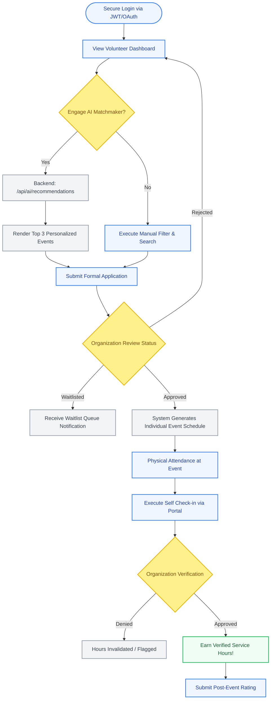
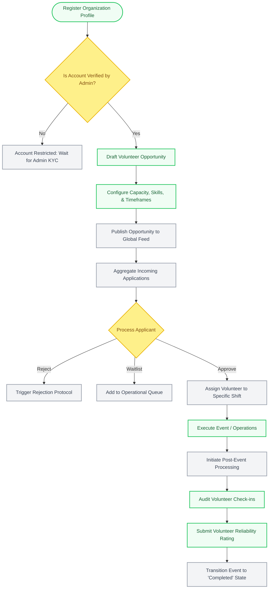
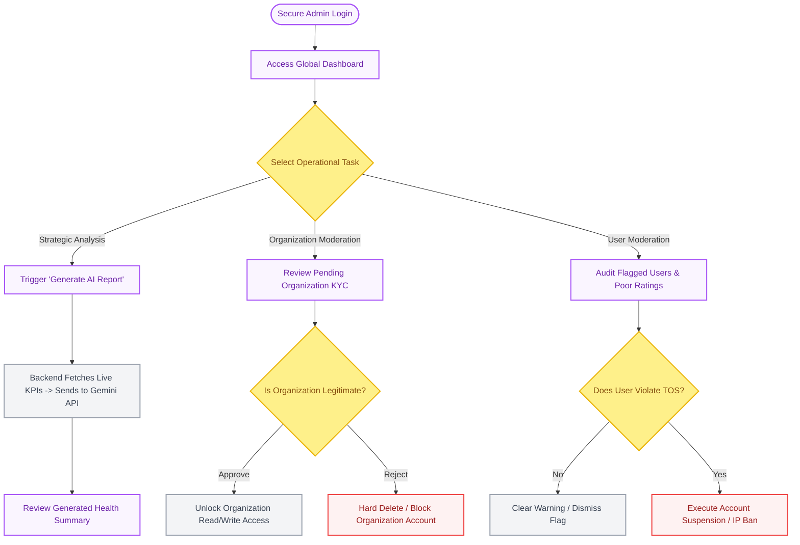

# 🗺️ Volunteer Management System (VMS)

**Detailed System Workflows & State Machines**

> **Executive Summary**  
> This document maps the exact technical workflows and state machines for the three core roles in the Volunteer Management System. These flowcharts are directly tied to the React routing layers, PostgreSQL database state transitions, and API endpoints utilized in the live application.

---

## 🎨 Diagram Legend

Before reviewing the workflows, please note the color-coding system used to identify the nature of each action:

- **[🟦 Blue Nodes]:** User-initiated actions (Frontend interactions).
- **[🟩 Green Nodes]:** Organizational interactions and successful terminal states.
- **[🟪 Purple Nodes]:** Administrative actions requiring high-level permissions.
- **[🟨 Yellow Diamonds]:** System logic gates or human decision points.
- **[⬜ Gray Nodes]:** Automated backend processes (API calls, cron jobs, or database triggers).
- **[🟥 Red Nodes]:** Destructive or punitive actions (e.g., account suspensions).

---

## 1. The Volunteer Journey

**Objective:** Discover relevant opportunities, complete applications, participate in events, and earn verified service hours.

_This workflow highlights the integration of the AI Matchmaking engine, which allows volunteers to bypass manual searching in favor of algorithmic, skill-based recommendations._

---

## 2. The Organization / Organizer Journey

**Objective:** Establish platform legitimacy, broadcast opportunities, manage applicant queues, and definitively verify volunteer labor.

_This workflow outlines the strict lifecycle of an 'Opportunity' state machine, moving from creation to applicant processing, and concluding with event validation._

---

## 3. The Platform Admin Journey

**Objective:** Maintain platform security, vet organizations to prevent fraudulent events, and utilize AI for strategic oversight.

_This workflow emphasizes the high-level moderation capabilities required to run a multi-tenant volunteer marketplace safely._

