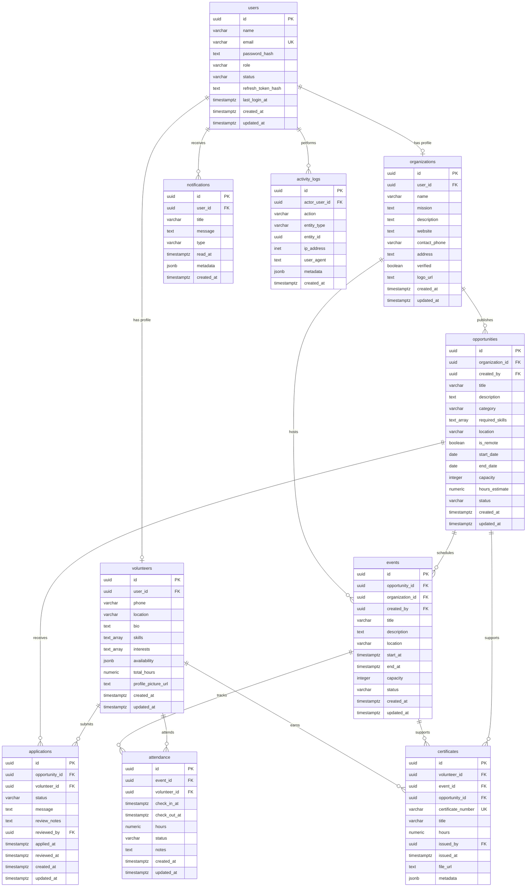

# Database ER Diagram

```mermaid
erDiagram
  users ||--o| volunteers : "has profile"
  users ||--o| organizations : "has profile"
  organizations ||--o{ opportunities : "publishes"
  opportunities ||--o{ applications : "receives"
  volunteers ||--o{ applications : "submits"
  organizations ||--o{ events : "hosts"
  opportunities ||--o{ events : "schedules"
  events ||--o{ attendance : "tracks"
  volunteers ||--o{ attendance : "attends"
  volunteers ||--o{ certificates : "earns"
  events ||--o{ certificates : "supports"
  opportunities ||--o{ certificates : "supports"
  users ||--o{ notifications : "receives"
  users ||--o{ activity_logs : "performs"

  users {
    uuid id PK
    varchar name
    varchar email UK
    text password_hash
    varchar role
    varchar status
    text refresh_token_hash
    timestamptz last_login_at
    timestamptz created_at
    timestamptz updated_at
  }

  volunteers {
    uuid id PK
    uuid user_id FK
    varchar phone
    varchar location
    text bio
    text_array skills
    text_array interests
    jsonb availability
    numeric total_hours
    text profile_picture_url
    timestamptz created_at
    timestamptz updated_at
  }

  organizations {
    uuid id PK
    uuid user_id FK
    varchar name
    text mission
    text description
    text website
    varchar contact_phone
    text address
    boolean verified
    text logo_url
    timestamptz created_at
    timestamptz updated_at
  }

  opportunities {
    uuid id PK
    uuid organization_id FK
    uuid created_by FK
    varchar title
    text description
    varchar category
    text_array required_skills
    varchar location
    boolean is_remote
    date start_date
    date end_date
    integer capacity
    numeric hours_estimate
    varchar status
    timestamptz created_at
    timestamptz updated_at
  }

  applications {
    uuid id PK
    uuid opportunity_id FK
    uuid volunteer_id FK
    varchar status
    text message
    text review_notes
    uuid reviewed_by FK
    timestamptz applied_at
    timestamptz reviewed_at
    timestamptz created_at
    timestamptz updated_at
  }

  events {
    uuid id PK
    uuid opportunity_id FK
    uuid organization_id FK
    uuid created_by FK
    varchar title
    text description
    varchar location
    timestamptz start_at
    timestamptz end_at
    integer capacity
    varchar status
    timestamptz created_at
    timestamptz updated_at
  }

  attendance {
    uuid id PK
    uuid event_id FK
    uuid volunteer_id FK
    timestamptz check_in_at
    timestamptz check_out_at
    numeric hours
    varchar status
    text notes
    timestamptz created_at
    timestamptz updated_at
  }

  certificates {
    uuid id PK
    uuid volunteer_id FK
    uuid event_id FK
    uuid opportunity_id FK
    varchar certificate_number UK
    varchar title
    numeric hours
    uuid issued_by FK
    timestamptz issued_at
    text file_url
    jsonb metadata
  }

  notifications {
    uuid id PK
    uuid user_id FK
    varchar title
    text message
    varchar type
    timestamptz read_at
    jsonb metadata
    timestamptz created_at
  }

  activity_logs {
    uuid id PK
    uuid actor_user_id FK
    varchar action
    varchar entity_type
    uuid entity_id
    inet ip_address
    text user_agent
    jsonb metadata
    timestamptz created_at
  }
```
